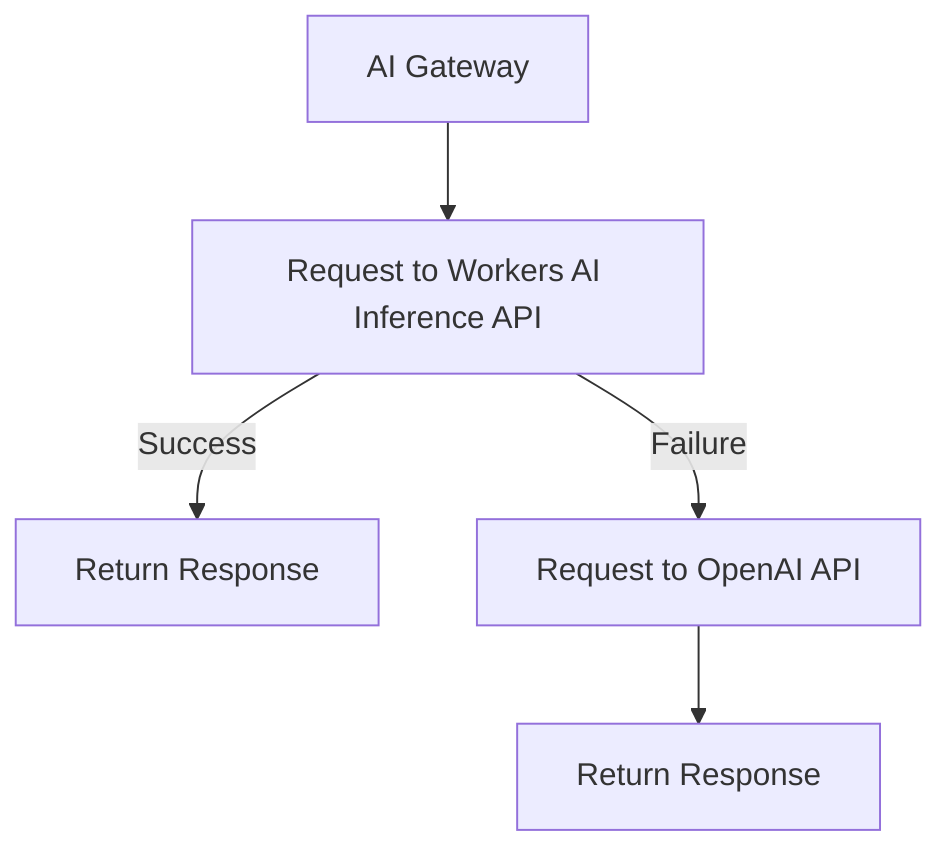

import { Render } from "~/components";

Specify model or provider fallback with your [Universal endpoint](/ai-gateway/providers/universal/) to specify what to do if a request fails.

## Example

For example, you could set up a gateway endpoint that:

1. Sends a request to Workers AI Inference API.
2. If that request fails, proceeds to OpenAI.

 

You can add as many fallbacks as you need, just by adding another object in the array.

<Render file="universal-gateway-example" />

## Response header(cf-aig-step)

When using the [Universal endpoint](/ai-gateway/providers/universal/) with fallbacks, the response header `cf-aig-step` indicates which model successfully processed the request by returning the step number. This header provides visibility into whether a fallback was triggered and which model ultimately processed the response.

- `cf-aig-step:0` – The first (primary) model was used successfully.
- `cf-aig-step:1` – The request fell back to the second model.
- `cf-aig-step:2` – The request fell back to the third model.
- Subsequent steps – Each fallback increments the step number by 1.
