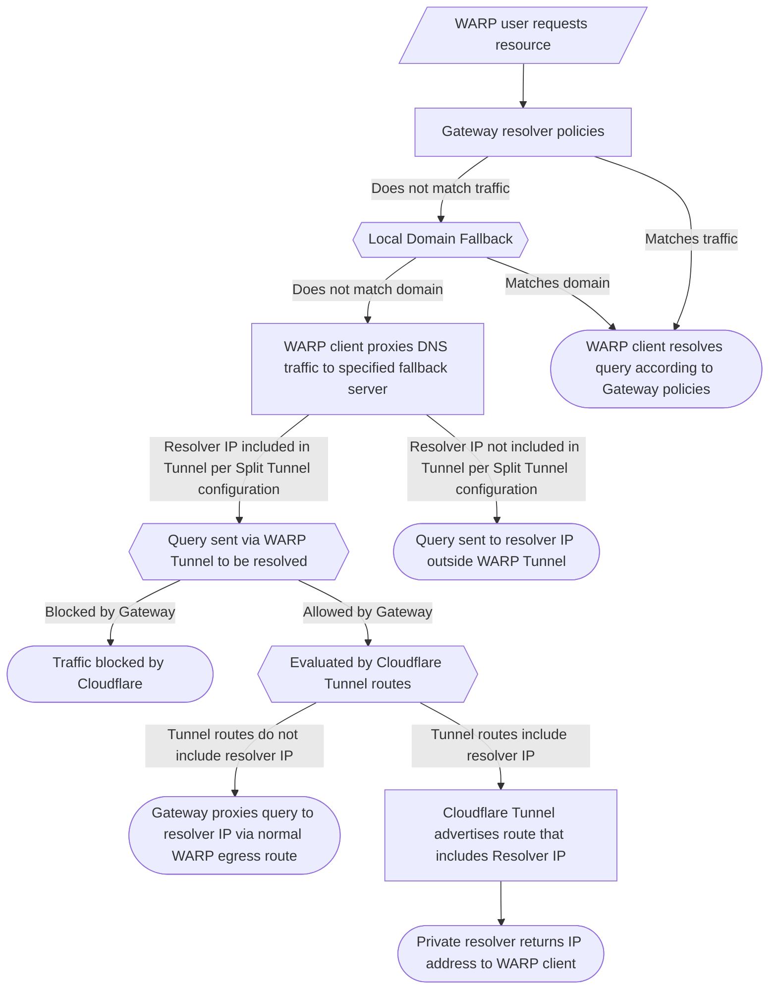

When the WARP client is deployed on a device, Cloudflare will process all DNS queries and network traffic by default. However, under certain circumstances, you may need to exclude specific DNS queries or network traffic from WARP. For example, you may need to resolve an internal hostname with a private DNS resolver instead of Cloudflare's [public DNS resolver](/1.1.1.1/).

Cloudflare recommends Enterprise users configure [Gateway resolver policies](/cloudflare-one/policies/gateway/resolver-policies/) to resolve traffic with custom resolvers. WARP will send private DNS queries to Gateway, then Gateway will send the queries to custom resolvers based on matching policies.

Additionally, there are three options you can configure to exclude traffic from WARP:

- [Local Domain Fallback](/cloudflare-one/connections/connect-devices/warp/configure-warp/route-traffic/local-domains/): Use Local Domain Fallback to instruct the WARP client to proxy DNS requests for a specified domain to a resolver that is not Cloudflare Gateway. This is useful when you have private hostnames that would not otherwise resolve on the public Internet.
  :::caution
  Gateway will not encrypt, monitor, or apply DNS policies to DNS queries to domain names entered in Local Domain Fallback.
  :::
- [Split Tunnels](/cloudflare-one/connections/connect-devices/warp/configure-warp/route-traffic/split-tunnels/) Exclude mode: Use Exclude mode to instruct the WARP client to ignore traffic to a specified set of IP addresses or domains. Any traffic that is destined to an IP address or domain defined in the Split Tunnels Exclude configuration will be ignored by the WARP client and handled by the local machine. Use this mode when you want the majority of your traffic encrypted and processed by Gateway, but need to exclude certain routes due to app compatibility, or if you need WARP to run alongside a VPN.
- [Split Tunnels](/cloudflare-one/connections/connect-devices/warp/configure-warp/route-traffic/split-tunnels/) Include mode: Use Include mode to instruct the WARP client to only handle traffic to a specified set of IP addresses or domains. Any traffic that is not included by an IP address or domain defined in the Split Tunnel Include configuration will be ignored by the WARP client and handled by the local machine. Use this mode when you only want specific traffic processed by Gateway, such as when using Tunnels for a specific resource.
  :::caution
  Gateway will not encrypt, manage, or monitor traffic excluded from WARP by a Split Tunnel configuration.
  :::

## How the WARP client handles DNS requests

When you use the WARP client together with `cloudflared` Tunnels or third-party VPNs, Cloudflare evaluates each request and routes it according to the following traffic flow:

