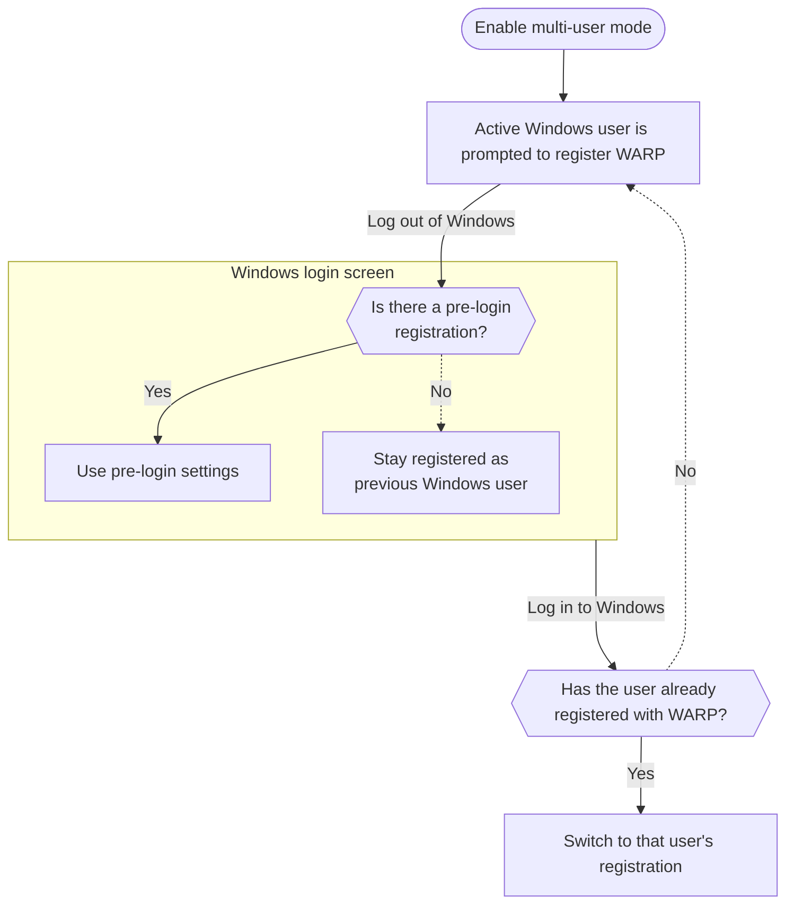

import { Details, Render, Badge } from "~/components";

<Details header="Feature availability">

| [WARP modes](/cloudflare-one/connections/connect-devices/warp/configure-warp/warp-modes/) | [Zero Trust plans](https://www.cloudflare.com/teams-pricing/) |
| ----------------------------------------------------------------------------------------- | ------------------------------------------------------------- |
| All modes                                                                                 | All plans                                                     |

| System   | Availability | Minimum WARP version |
| -------- | ------------ | -------------------- |
| Windows  | ✅           | 2024.12.326.1        |
| macOS    | ❌           |                      |
| Linux    | ❌           |                      |
| iOS      | ❌           |                      |
| Android  | ❌           |                      |
| ChromeOS | ❌           |                      |

</Details>

Cloudflare WARP supports multiple user registrations on a single Windows device. When deployed in multi-user mode, the WARP client will automatically switch user registrations after a user logs in to their Windows account. All traffic to Cloudflare will be attributed to the currently active Windows user. This allows administrators to apply identity-based policies and device settings, audit user activity, and remove individual users from a shared workstation.

:::note
A user must log out of their Windows account before switching to another account. A user cannot lock the screen and log in to another account, use the **Switch users** option in Windows, or have any other type of concurrent sessions.
:::

## Enable multi-user mode

To enable multi-user support on Windows, [deploy an MDM file](/cloudflare-one/connections/connect-devices/warp/deployment/mdm-deployment/#windows) onto the device with the `multi_user` key set to `true`. For example:

```xml
<dict>
  <key>multi_user</key>
  <true/>
  </dict>
  <key>configs</key>
  <array>
    <dict>
      <key>organization</key>
      <string>your-team-name</string>
      <key>display_name</key>
      <string>Default</string>
    </dict>
  </array>
</dict>
```

To use multi-user mode alongside the [Windows pre-login](/cloudflare-one/connections/connect-devices/warp/deployment/mdm-deployment/windows-prelogin/) and [Switch between Zero Trust organizations](/cloudflare-one/connections/connect-devices/warp/deployment/mdm-deployment/switch-organizations/) options:

```xml
<dict>
  <key>multi_user</key>
	<true/>
  <key>pre_login</key>
  <dict>
    <key>organization</key>
    <string>mycompany</string>
    <key>auth_client_id</key>
    <string>88bf3b6d86161464f6509f7219099e57.access</string>
    <key>auth_client_secret</key>
    <string>bdd31cbc4dec990953e39163fbbb194c93313ca9f0a6e420346af9d326b1d2a5</string>
  </dict>
  <key>configs</key>
  <array>
		<dict>
			<key>organization</key>
			<string>mycompany</string>
			<key>display_name</key>
			<string>Production environment</string>
  	</dict>
		<dict>
			<key>organization</key>
			<string>test-org</string>
			<key>display_name</key>
			<string>Test environment</string>
		</dict>
  </array>
</dict>
```

When enabling multi-user mode for the first time, users will need to re-register even if they had a previous registration.

## WARP registration logic

The following flowchart shows how WARP registration settings take effect as users log in and out:



