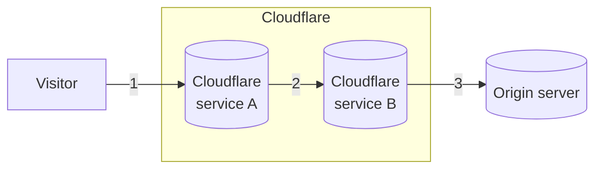

Post-quantum cryptography (PQC) refers to cryptographic algorithms that have been designed to resist attacks from [quantum computers](https://www.cloudflare.com/learning/ssl/quantum/what-is-quantum-computing/). Cloudflare has been researching and [writing about post-quantum](https://blog.cloudflare.com/tag/post-quantum/) since 2017.

To protect you against the risk of [harvest now, decrypt later](https://en.wikipedia.org/wiki/Harvest_now,_decrypt_later), and considering all the [connections](#three-connections-in-the-life-of-a-request) that take place when your website or application is on Cloudflare, we have deployed and are actively expanding the use of [post-quantum hybrid key agreement](#hybrid-key-agreement).

Refer to [Cloudflare Radar](https://radar.cloudflare.com/adoption-and-usage#post-quantum-encryption-adoption) for current statistics on the adoption of PQ encryption in requests to Cloudflare, and visit [pq.cloudflareresearch.com](https://pq.cloudflareresearch.com) to check if your connection is secured using PQ key agreement.

:::caution[TLS 1.3]
Cloudflare post-quantum key agreements are only supported in protocols based on TLS 1.3 (including HTTP/3) and are disabled for websites in [FIPS mode](/cloudflare-one/policies/gateway/http-policies/tls-decryption/#fips-compliance).
:::

## Three building blocks of TLS

Before TLS can protect your communications, three cryptographic algorithms have to be agreed on during the [TLS handshake](https://www.cloudflare.com/learning/ssl/what-happens-in-a-tls-handshake/):

- **Symmetric ciphers:** Algorithms used to encrypt and decrypt data, ensuring confidentiality and integrity (such as `CHACHA20-POLY1305`).
- **Key agreement:** A cryptographic protocol that allows client and server to safely agree on a shared key (such as `ECDH`).
- **Signature algorithms:** Cryptographic algorithms used to generate the digital signatures in TLS certificates (such as `RSA` and `ECDSA`).

As explained in our [blog post](https://blog.cloudflare.com/pq-2024/#two-migrations), symmetric ciphers are already post-quantum secure, which means there are two migrations left to occur.

### Hybrid key agreement

With TLS 1.3, [X25519](https://en.wikipedia.org/wiki/Curve25519) - an Elliptic Curve Diffie-Hellman (ECDH) protocol - is the most commonly used algorithm in key agreement. However, its security can be easily broken by quantum computers using [Shor's algorithm](https://en.wikipedia.org/wiki/Shor%27s_algorithm).

It is urgent to migrate key agreement to post-quantum algorithms as soon as possible. The objective is to protect against an adversary capable of harvesting today's encrypted communications and storing it until some time in the future when they can gain access to a sufficiently powerful quantum computer to decrypt it.

In response to this, Cloudflare is an early adopter of ML-KEM, the post-quantum key agreement selected by the US National Institute of Standards and Technology (NIST). For a detailed timeline and more background information refer to [The state of the post-quantum Internet](https://blog.cloudflare.com/pq-2024/).

Cloudflare has deployed the following hybrid key agreements:

- [X25519MLKEM768](https://datatracker.ietf.org/doc/draft-kwiatkowski-tls-ecdhe-mlkem/) (Recommended)
    - TLS identifier: `0x11ec`
- [X25519Kyber768Draft00](https://datatracker.ietf.org/doc/draft-tls-westerbaan-xyber768d00/) (Obsolete)
    - TLS identifier: `0x6399`

A hybrid key agreement lays the groundwork as more and more [clients](#1-visitor-to-cloudflare) adopt post-quantum cryptography, while also maintaining the current security provided by X25519. It is a safer path in case of an unexpected breakthrough that renders all variants of ML-KEM insecure.

### Post-quantum signatures

The migration to post-quantum signatures is less urgent and more involved. Cloudflare is closely following the developments of new standards, testing their performance, and working together with browsers to understand user impact.

For details refer to [A look at the latest post-quantum signature standardization candidates](https://blog.cloudflare.com/another-look-at-pq-signatures/).

## Three connections in the life of a request

### 1. Visitor to Cloudflare

As of [October 2022](https://blog.cloudflare.com/post-quantum-for-all/), all websites and APIs served through Cloudflare over TLS 1.3 support post-quantum hybrid key agreement. However, the connection is only post-quantum secured if the client also supports PQC.

Refer to [Post-quantum cryptography support](/ssl/post-quantum-cryptography/pqc-support/) for a list of browsers and other clients that are compatible with hybrid key agreements.

### 2. Internal connections

As announced in [September 2023](https://blog.cloudflare.com/post-quantum-cryptography-ga/), most internal connections for Cloudflare's products and systems have been upgraded to use PQC.

### 3. Cloudflare to your origin

Finally, Cloudflare also supports [hybrid key agreements](#hybrid-key-agreement) when connecting to origins. In this case, post-quantum secured connections will depend on the origin servers also supporting PQC.

Refer to [Post-quantum cryptography between Cloudflare and origin servers](/ssl/post-quantum-cryptography/pqc-to-origin/) for details.