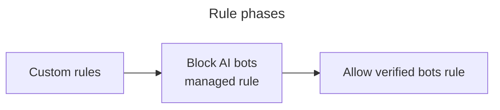

---
{}

---

You can block artificial intelligence (AI) bots, crawlers, and scrapers from scraping your website content and training large language models (LLM) to recreate it without your permission. 

:::note
Some AI bots overlap with definitely automated bots and verified bots, the latter becoming verified AI bots.

For a partial list of verified AI Bots, refer to the [Cloudflare Radar](/radar/) categories of AI Search, AI Assistant, AI Crawler, and Archiver.
:::

When you enable this feature via a pre-configured managed rule, Cloudflare can detect and block verified AI bots that comply with `robots.txt` and respect crawl rates, and do not hide their behavior from your website. The rule has also been expanded to include more signatures of AI bots that do not follow the rules.

The rule to block AI bots takes precedence over all other Super Bot Fight Mode rules. For example, if you have enabled **Block AI bots** and **Allow verified bots**, verified AI bots will also be blocked even if you allow other verified bots on your website or application.

For Bot Management customers, if you have set a rule to serve managed challenges to definitely automated bots, AI bots will also be challenged because custom rules run in a phase before Super Bot Fight Mode, which is the phase when the rule to block AI bots runs. 

This behavior remains the same if the setting for verified, definitely automated, and likely bots is set to `block` or `allow`. If you have an action to `allow` for these rules, the request is not matched to any rule and proceeds to the next ruleset phase. Similarly, if the action is set to `block`, they will be blocked in the earlier phase and do not move on to match the AI rule at all. However, when the action is `challenge`, the request matches a rule and therefore will not be matched to any rules after. 

For self-serve non-Bot Management customers, all rules for verified, definitely automated, and likely bots run in the phase following the AI bots rule. 

This feature is available on all Cloudflare plans.
